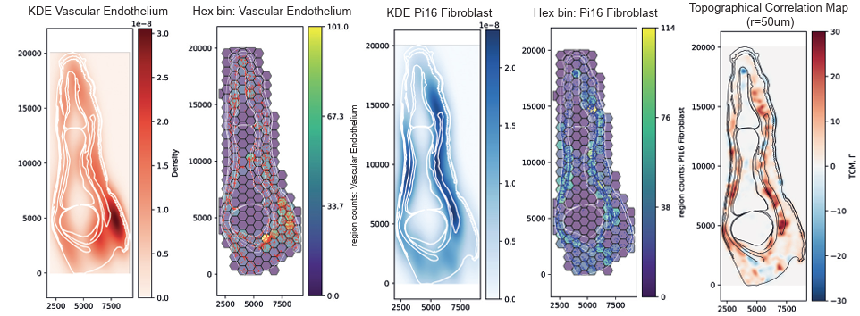

# 2026 NI Manuscript
Materials and code for analysis in 2026 Manuscript. Spatial analysis of PI16+ Fibroblasts, PRG4+ Fibroblasts, and VWF+ endothelium across whole, human, developmental manual digits with accompanying tissue annotations for compartment analysis.



Data Repository: RELEASED 24 Apr 2026

## Environment Setup
### Requirements
- CUDA 12.1 compatible GPU (≥8 GB VRAM recommended)
- conda or mamba

### Option A: conda/mamba (recommended)
```bash
mamba env create -f environment.yml
conda activate ni_manuscript
```

### Option B: Docker (GPU)
```bash
docker build -t ni_manuscript .
docker run --gpus all -it --rm -v $(pwd):/workspace ni_manuscript
```

> **Note on MuSpAn**: This package is not on PyPI - See https://docs.muspan.co.uk for documentation.

## Workflow
For full methods (including data collection and staining protocols / procedures) please refer to the original publication. Images acquired samples derived from 3 donors on the CellDIVE platform (20x magnification, 0.325µm/pixel) with 4 markers: DAPI (DAPI_INIT and DAPI_FINAL), PI16, PRG4, and VWF.
### Ingest and Segmentation
- `run_batch_analysis.py` calling `run_spatial_analysis.py`.

### Sample phenotyping
Cell types were phenotyped by mixed methods, including graph-based clustering per sample. The latter was used for downstream analysis.

### Spatial Analysis
- Generate metadata file: `generate_metadata_from_samples.py`
- `run_spatial_statistics_v3.py`

### Proximal/Distal Enrichment
```bash
python scripts/prox_dist_enrichment_analysis.py --data-dir /path/to/data/processed/prox_dist
# Optional: specify a separate output directory
python scripts/prox_dist_enrichment_analysis.py --data-dir ./data/processed/prox_dist --output-dir ./results/enrichment
```

## References and acknowledgements
Please refer to the original manuscript for full acknowledgements and references. \
Particularly grateful to the developers and maintainers of [MuSpAn](https://www.muspan.co.uk/resources), [SpatialData](https://github.com/scverse/spatialdata), and [CellPose](https://github.com/mouseland/cellpose).
```bibtex
@article{bull2024muspan,
  title={MuSpAn: a toolbox for multiscale spatial analysis}, 
  author={Bull, Joshua A and Moore, Joshua W and Mulholland, Eoghan J and Leedham, Simon J and Byrne, Helen M},
  journal={bioRxiv},
  year={2024},
  publisher={Cold Spring Harbor Laboratory}
}
```
```bibtex
@article{marconato2025spatialdata,
  title={SpatialData: an open and universal data framework for spatial omics},
  author={Marconato, Luca and Palla, Giovanni and Yamauchi, Kevin A and Virshup, Isaac and Heidari, Elyas and Treis, Tim and Vierdag, Wouter-Michiel and Toth, Marcella and Stockhaus, Sonja and Shrestha, Rahul B and others},
  journal={Nature methods},
  volume={22},
  number={1},
  pages={58--62},
  year={2025},
  publisher={Nature Publishing Group US New York}
}
```
```bibtex
@article{stringer2021cellpose,
  title={Cellpose: a generalist algorithm for cellular segmentation},
  author={Stringer, Carsen and Wang, Tim and Michaelos, Michalis and Pachitariu, Marius},
  journal={Nature methods},
  volume={18},
  number={1},
  pages={100--106},
  year={2021},
  publisher={Nature Publishing Group US New York}
}
```